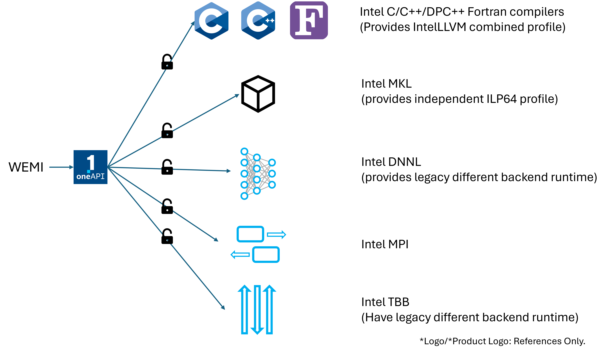

SPDX-License-Identifier: MIT
Copyright (c) 2026-${year} WEMI Contributors

This software is released under the MIT License.
https://opensource.org/licenses/MIT

<!-- # SPDX-License-Identifier: MIT -->
<!-- # Copyright (c) 2026 TaiXeflar  -->

# Intel oneAPI

WEMI will configure Intel oneAPI root from registry and define any Intel components from that base directory.

WEMI is not guranteed with any not tested Intel oneAPI and Intel Parallel XE Studio, with these version is not able to download and telling install configuration differences.

Intel profiles are open selection with required `intel/oneapi` profile.

## Intel C/C++/DPC++ and Visual Fortran compiler

With IntelLLVM is available, WEMI generates modulefile will extend a rule with IntelLLVM contained Tcl Modulefile.

- Intel oneAPI DPC++/C++ / Visual Fortran compiler 2021.X
- Intel oneAPI DPC++/C++ / Visual Fortran compiler 2022.X
- Intel oneAPI DPC++/C++ / Visual Fortran compiler 2023.X
- Intel oneAPI C/C++ / Visual Fortran compiler 2024.X
- Intel oneAPI C/C++ / Visual Fortran compiler 2024.X

## Intel Math Kernel Library (Intel MKL)
- Intel MKL 2021.X
- Intel MKL 2022.X
- Intel MKL 2023.X
- Intel MKL 2024.X
- Intel MKL 2025.X

## Intel Deep Neural Networks Library (oneDNN/dnnl)
- Intel DNNL 2021.X
- Intel DNNL 2022.X
- Intel DNNL 2023.X
- Intel DNNL 2024.X
- Intel DNNL 2025.X

## Intel Message Passing Interface (Intel MPI)

## Intel Thread Building Blocks (Intel TBB)

## Intel Thread Composability Manager (Intel TCM)

## Intel Debugger (Intel GDB)

## \_\_future\_\_
 - Intel Data Analytics Library
 - Intel IPP
 - Intel IPPCP
 - Intel ocloc
 - Intel umf
 - Intel Inspector
 - Intel dppcp-ct
 - Intel Toolkit Linking Tool
