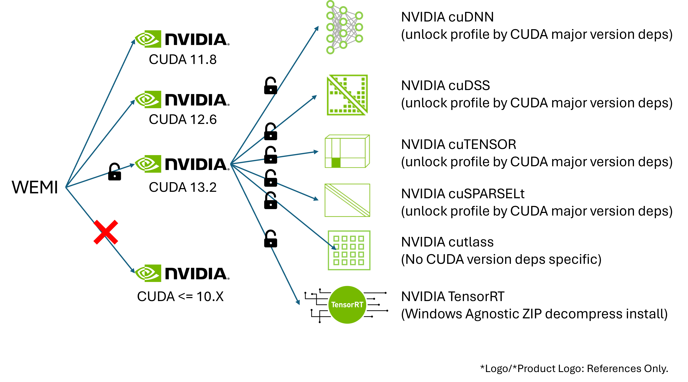

# NVIDIA SDK supported list

## NVIDIA CUDA Toolkit

The possiable NVIDIA CUDA Toolkit configuration support range will be around over CUDA 11. CUDA 10 and lower version is not guranteed to support.

 - CUDA 11
 - CUDA 12
 - CUDA 13

Any CUDA-X Library(ies) will set with its required CUDA Major version dependicies, within a level-access module load progress.

## NVIDIA cuDNN Library

Within CUDA Toolkit Version limitation mentioned above, most of cuDNN is supported if cuDNN's DLL `cudnn64_X.dll` is analyzable.
 - cuDNN 7
 - cuDNN 8
 - cuDNN 9

  
## NVIDIA cuDSS
 - cuDSS 0.X.Y 

## NVIDIA cuTENSOR
 - cuTENSOR 1.X
 - cuTENSOR 2.X

## NVIDIA cuSPARSELt

## NVIDIA cuTENSOR
 - cuTENSOR 1.X
 - cuTENSOR 2.X

## NVIDIA TensorRT

## NVIDIA cutlass
NVIDIA cutlass is version analyzable and CUDA major version non-analyzable, so NVIDIA/cutlass will be a general unlock options.

When you load any `nvidia/cuda` profile, you can see unlocked `nvidia/cutlass` options.

## \_\_future\_\_
- NVIDIA cuTile (if independent build is analyzable)
- NVIDIA cuQuantum (if it is support to Windows)
- NVIDIA cuPQC (if it is support to Windows)
- NVIDIA HPC SDK (if is re-starts support to Windows x64/ARM64)
- NVIDIA CUDA Toolkit (Update patch on if Windows ARM64 release)