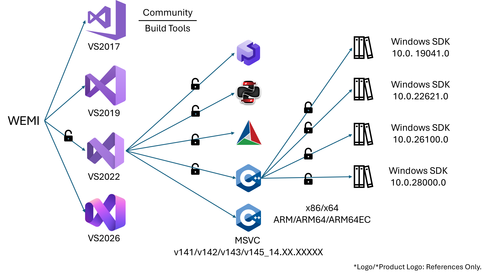

 <!-- SPDX-License-Identifier: MIT
 Copyright (c) 2026-${year} WEMI Contributors
 This software is released under the MIT License.
 https://opensource.org/licenses/MIT -->

# Microsoft Visual Studio Support


## Visual Studio `vs/20XX/VERSION`

WEMI support several Visual Studio installations:
- VS2017 Community, BuildTools
- VS2019 Community, BuildTools
- VS2022 Community, BuildTools
- VS2026 Community, BuildTools

WEMI will search installed Visual Studio locations, generates profile with `vs/20XX/VERSIONS`

WEMI takes level-access control to unlock its installed compoments. Usage:
```
 envmodule load vs/2026/BuildTools
 envmodule load msvc/v145_14.50.35717/x64
 envmodule load ucrt/10.0.22621.0

 cl.exe
 rc.exe
```



WEMI and its MSVC, CMake will not auto load Windows SDK/UCRTs.

## MSVC Compilers `msvc/v14X_14.YY.ZZZZZ/ARCH`
The MSVC profiles will depend on MSVC version `XX.YY.ZZZZZ` and set `v14X` name rules with underscore, then compiler target.

For example, a VS2026 provided MSVC v145 14.50.35717 x64 compiler will be `msvc/v145_14.50.35717/x64` after VS2026 is loaded.

- WEMI will set MSVC profiles, including (Assume) MSVC compiler have ATL/MFC library path. WEMI will not set Spectre profiles.

Current supported MSVC compilers:
 - MSVC v141 (14.1X)
 - MSVC v142 (14.2X)
 - MSVC v143 (14.3X, 14.4X)
 - MSVC v145 (14.5X)

Supported Targets will depend on MSVC version, supported history to generate specific Modulefiles.
 - x86
 - x64
 - ARM
 - ARM64
 - ARM64EC (WEMI will generates a cmake toolchain file and combine it (specify `CMAKE_TOOLCHAIN_FILE`).)

## MSVC Redistributables
WEMI will not generate MSVC redistributables modulefiles.

## LLVM/Clang
WEMI will generates LLVM Tcl Modulefile rules with VS20XX pre-load level access.

WEMI will only generates targets specific to host device. For example, if your device is x64, tthis LLVM profile will only set x64 toolchains to your paths.

## MSBuild, CMake, Ninja-Build
As VS20XX installer set MSBuild, CMake support as optional, so WEMI will generate each file on it.

You can take seperating control with VS20XX contained CMake and Ninja-Build executables.


## Windows SDK / Universal CRT
Windows SDK will have its install directory. So Windows SDK will be independent to VS20XX profiles.

Windows SDK's profile name is `ucrt`. Typically ucrt(s) will follow loaded msvc profiles targets and loading ucrt's related sdk components.

For example, if you load `msvc/v145_14.50.35717/x64`, you will get options like `ucrt/10.0.28000.0` with ucrt components have already set DLLs/Libs to x64.


## \_\_future\_\_

 - Disscuss on Roslyn compilers.
 - Disscuss on MSVC redist.
